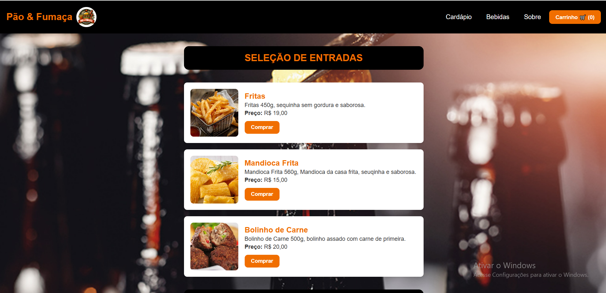
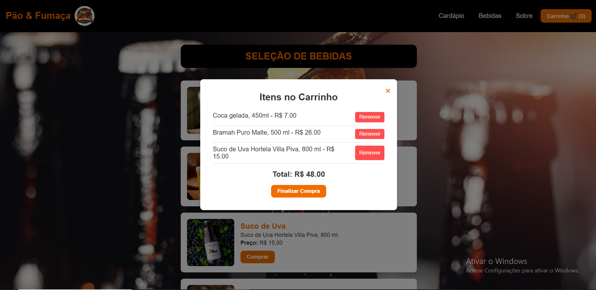

# PaoeFuamca
 ### Mapa Mental - Desenvolvimento do Projeto do Cardápio
 1. Identidade Visual
 Nome do Restaurante: Pão & Fumaça
 Cores: Preto, Laranja e Vermelho Vinho
 Estilo: Rústico, acolhedor, inspirado na grelha e defumação
 
 ##
 2. História e Conceito
 Origem: Paixão pela grelha e carne defumada
 Foco: Hambúrgueres artesanais com ingredientes frescos
 Experiência: Sensória e ambiente acolhedor
 Objetivo: Celebração de sabor e amizade
 
 ##
 3. Requisitos do Sistema (Pedido do Cliente)
 Cada prato deve conter:
 
 
 
 ### Página Inicial
 Cabeçalho com botões: HOME, CARDÁPIO, SOBRE NÓS
 Destaques: Mostrar os "Lanches do Dia"
 Botão "VER MAIS" direcionando para a página do cardápio
 
 
 
 
 
 ### Página do Cardápio
 Cabeçalho presente
 Listagem dos itens do cardápio:
 Cheddar Bacon Deluxe - R$ 28,00
 Burger Caipira - R$ 26,00
 Picanha na Brasa - R$ 35,00
 Veggie Supreme - R$ 24,00
 Tropical Bacon - R$ 30,00
 4.3. Bebidas
 Coca-Cola - R$ 6,00
 Água Mineral - R$ 4,00
 Suco Natural de Laranja - R$ 8,00
 Refrigerante de Guaraná - R$ 6,00
 Chopp Artesanal - R$ 12,00
 
 
 ##
 ### Recursos Extras
 Possibilidade de adicionar imagens aos pratos
 Design responsivo e intuitivo
 Possibilidade de futuras melhorias, como sistema de pedidos online
 
 ### Requisitos Funcionais
 O sistema deve permitir a exibição do cardápio com nome, descrição, preço e imagem dos pratos.
 O usuário deve poder visualizar os "Lanches do Dia" na página inicial.
 Deve haver um botão "VER MAIS" que leva para a página completa do cardápio.
 O cabeçalho deve conter navegação entre HOME, CARDÁPIO e SOBRE NÓS.
 O sistema deve permitir a adição e edição de pratos no cardápio (caso haja painel administrativo no futuro).
 ### Requisitos Não Funcionais
 O sistema deve ser responsivo para diferentes dispositivos (desktop, tablet e mobile).
 O carregamento das páginas deve ser rápido e eficiente.
 A interface deve ser intuitiva e amigável para os usuários.
 O design deve seguir a identidade visual do restaurante (cores e estilo).
 Deve haver segurança na gestão de dados dos pratos.

O projeto original se encontra em outro repositório, conta: 
BackupTrabalho1212
